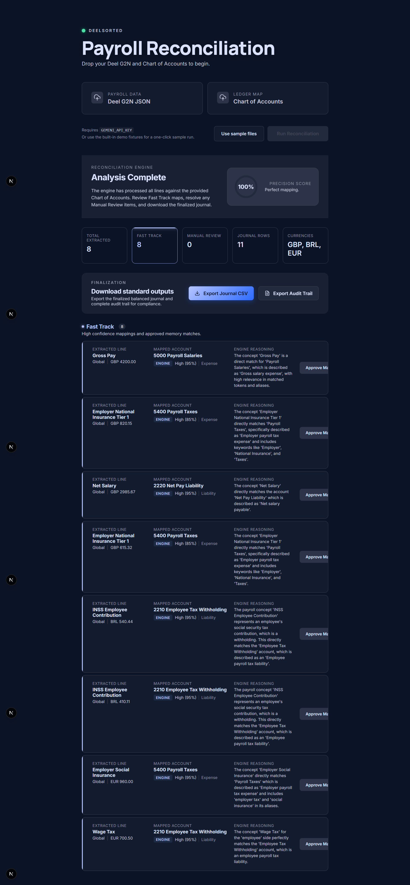

# DeelSorted

DeelSorted is a demo-first payroll reconciliation app. It accepts a supported Deel G2N payroll JSON file and a supported chart of accounts CSV, matches each payroll concept to the right GL account, and turns the result into a clean journal entry that finance can review and export.

## At a glance

- payroll input today is one supported Deel G2N-style JSON shape
- COA input today is one supported CSV family with canonical headers or curated header aliases
- AI is only used for semantic mapping from payroll concepts to GL account candidates
- journal math, balancing, anomaly handling, and CSV exports stay deterministic
- approved mappings are only reused after explicit human approval

## Current UI



## What it does

Deel payroll exports use payroll and tax labels that accountants usually do not work with directly. A few examples:

- `UK_NI_Employer_Contribution_Tier_1`
- `BR_INSS_Empregado`
- `DE_Sozialversicherung_AG_Anteil`

Accounting teams need those lines translated into the company's own chart of accounts, for example:

- `GL 5400: Payroll Taxes`
- `GL 6100: Employee Benefits`
- `GL 2200: Payroll Liabilities`

DeelSorted is being built to do that translation faster, with clear reasoning and a clean review flow.

## Why this exists

Today this work is often manual:

- someone downloads payroll data
- someone reads unfamiliar country-specific codes
- someone maps each line to a GL account
- someone builds the journal entry
- someone checks whether it balances

That is slow, repetitive, and easy to get wrong, especially when payroll spans several countries and currencies.

The goal of DeelSorted is to make the hard part easier without hiding uncertainty. When the app is confident, it should move quickly. When it is not, it should surface the line clearly and explain why it needs review.

## How the demo is meant to work

The first demo is intentionally narrow.

1. Upload one supported Deel G2N-style payroll JSON file.
2. Upload one supported chart of accounts CSV file.
3. Click `Reconcile`.
4. The app cleans up the payroll labels into a simpler internal form.
5. The app finds the best account candidates.
6. Gemini chooses the best match from those candidates and returns structured output.
7. The app shows mapped lines, confidence, anomaly lines, and a balanced journal by currency.
8. The user downloads a journal CSV and an audit trail CSV.
9. Approved mapping decisions can be reused later.

The browser UI also includes a `Use sample files` path that loads the checked-in demo payroll and COA fixtures for a one-click local trial run.

## Supported inputs

### Payroll JSON

Supported today:

- official-shape Deel Global Payroll Gross-to-Net response bodies
- schema-faithful mock G2N JSON files used for demo verification

Rejected today:

- arbitrary payroll JSON arrays
- unknown contract wrappers
- generic HR or finance datasets
- the preserved legacy payroll fixture as a live upload path

### COA CSV

Supported today:

- CSV files with the canonical demo header row
- CSV files that use the curated alias set documented in `fixtures/README.md`

The current runtime does not support arbitrary CSV inference or COA JSON uploads.

## Why the design is trustworthy

AI is only used for the mapping decision.

The rest stays deterministic:

- file parsing
- payroll label cleanup
- journal building
- debit and credit balancing
- CSV generation
- anomaly handling
- approved-memory reuse rules

Other boundaries that matter:

- unsupported or uncertain cases should be quarantined as anomalies, not forced through
- only explicit human-approved mappings may be reused later
- the current runtime supports the schema-faithful Deel G2N payroll shape and one COA CSV family with curated header aliases
- the app is local-facing but not fully offline because Gemini runs server-side

That split matters. The language problem is where AI helps. The accounting math stays under application control.

## What is in the repo today

This repo is no longer docs-only. It now contains:

- the idea write-up
- the v1 spec
- the implementation plan
- project rules in `AGENTS.md`
- source-backed implementation notes
- a project-specific TDD playbook
- a minimal Next.js App Router scaffold
- a working Vitest test harness
- fixture-backed reconciliation domain logic
- a server route for running reconciliation
- a server route for saving approved mappings
- a browser upload flow with mapped-line review, anomaly detail, CSV downloads, and approval actions

The core demo loop is now in place through Task 12 closeout, with the final verification snapshot recorded below.

## Current status

Status today: planning is complete, Tasks 1 through 12 are implemented, and the upload -> reconcile -> inspect -> download -> approve browser flow is wired up with explicit ready, loading, and error states.

What is already done:

- Next.js with TypeScript is set up
- ESLint is set up
- Vitest is set up
- the supported payroll JSON and COA CSV fixtures are in the repo
- parsing, normalization, retrieval, Gemini orchestration, journal building, and audit export helpers are implemented
- `/api/reconcile` accepts uploaded files and returns structured reconcile results
- `/api/approvals` persists confirmed mappings to local JSON storage
- the home page lets you upload the supported files, review mapped lines, inspect anomalies, download journal and audit trail CSVs, and approve confirmed mappings
- malformed or unsupported uploads fail with clear recoverable error messages instead of leaving the UI in an ambiguous state
- the reconcile form now shows explicit ready, loading, and stopped-safe error states during submission
- the UI has been completely overhauled with the "Precision Absolute" design system based on Sovereign Functionalism, using a high-contrast, low-cognitive-load laboratory-white aesthetic with 0px border radiuses, tonal background shifts instead of visible borders, and strict monospaced numeric data
- the results UI shows selected GL account, confidence, reasoning, and whether a mapping came from the model or approved memory
- approving a mapped line stores it for future reruns of the same normalized concept
- integration tests cover the results rendering, local approval persistence, approved-memory reuse flow, and invalid upload error states
- the app builds and serves locally in WSL
- the workspace-root warning from the unrelated WSL `pnpm-lock.yaml` is handled in `next.config.ts`
- the repo now includes explicit Deel G2N schemas plus a schema-faithful mock G2N fixture
- the live payroll parser now normalizes the checked-in G2N fixture into the existing deterministic reconcile flow
- the upload route and browser UI now explicitly label the payroll upload as `Deel G2N JSON`
- malformed payroll JSON and unsupported payroll schema now produce distinct G2N-specific upload errors
- the COA parser now accepts a curated alias set for common CSV headers and safely defaults omitted `description` and `aliases` columns
- the mocked end-to-end G2N follow-up now re-verifies the route, results/downloads, and approval-memory reuse flow against G2N-derived lines

## How to run the project

Run every command from a WSL shell rooted at this repository:

```bash
npm install
npm run dev
```

Then open `http://localhost:3000` in your browser.

Before running the Gemini-backed flow locally, create `.env.local` in the repo root with either:

```bash
GEMINI_API_KEY=your_key_here
```

or:

```bash
GOOGLE_API_KEY=your_key_here
```

Demo fixtures live at:

- `fixtures/payroll-sample.json`
- `fixtures/payroll-large-sample.json`
- `fixtures/coa-sample.csv`
- `fixtures/coa-alias-sample.csv`
- `fixtures/coa-large-sample.csv`

`fixtures/payroll-sample.json` is the schema-faithful Deel G2N mock used by the checked-in runtime today.

`fixtures/payroll-large-sample.json` is a larger schema-faithful Deel G2N mock with `150` contracts and `1200` item lines for load-style demos and parser validation.

`fixtures/payroll-legacy-sample.json` remains in the repo as a preserved reference fixture, but it is no longer the supported upload path after the parser cutover slice.

`fixtures/coa-large-sample.csv` is the matching broader canonical COA fixture for the larger payroll sample.

Fixture field details are documented in `fixtures/README.md`.

Useful commands:

- `npm run dev` starts the app
- `npm run dev:turbopack` starts the app with Turbopack
- `npm run build` creates a production build
- `npm run start` runs the production server
- `npm run lint` checks the code style rules through the WSL-safe runner in `scripts/run-eslint.mjs`
- `npm run typecheck` checks TypeScript
- `npm run test` runs the Vitest suite

## Current demo flow

Today the local demo supports this browser-visible slice:

1. Start the app with `npm run dev`.
2. Open `http://localhost:3000`.
3. Either click `Use sample files` for the built-in demo path, or upload `fixtures/payroll-sample.json` as the `Deel G2N JSON` file.
4. If you choose the manual path, upload `fixtures/coa-sample.csv` or `fixtures/coa-alias-sample.csv`.
5. Run reconciliation.
6. Review the selected GL account, confidence, journal role, and reasoning for each mapped line.
7. Review anomalies in a separate panel with a human-readable reason.
8. Download the journal CSV and audit trail CSV for the completed run.
9. Approve any mapped line you want to reuse later.
10. Rerun reconciliation and see reused decisions marked as `Approved memory`.

The route currently depends on a server-side Gemini API key and returns structured JSON that the browser renders into the review and export UI. If an upload is missing, malformed, or unsupported, the app now keeps the page usable and shows a clear error state instead of stale results.

## Current implementation note

The checked-in Gemini runtime uses a small server-side Developer API client in `src/features/reconcile/server/runtime.ts` and passes its responses through the schema-validated mapping adapter in `src/features/reconcile/server/gemini.ts`. The approved spec still tracks `@google/genai` as the preferred SDK direction, but that package is not a current repository dependency.

## G2N ingestion status

The planned G2N ingestion follow-up is now landed through its mocked end-to-end verification and doc-sync closeout. The repo now contains explicit Deel G2N schemas, a schema-faithful mock G2N fixture, a live payroll parser that converts G2N items into canonical payroll lines for the existing reconcile engine, upload wording that explicitly labels the supported payroll input as `Deel G2N JSON`, flexible COA CSV alias support, and integration coverage that re-verifies route behavior, results/downloads output, and approval-memory reuse against the G2N-derived flow.

The dedicated G2N plan/spec docs remain in the repo as implementation history and scope reference:

- `docs/specs/deelsorted-g2n-ingestion-spec.md`
- `docs/specs/deelsorted-g2n-ingestion-plan.md`

## Repository map

```text
app/                           -> Next.js routes and pages
src/features/reconcile/ui/     -> Upload flow, result views, approvals UI
src/features/reconcile/domain/ -> Pure logic: normalization, journal, export
src/features/reconcile/server/ -> Orchestration, Gemini adapter, memory, retrieval
src/lib/parsers/               -> Payroll JSON and COA CSV parsing
src/lib/env/                   -> Environment validation
src/types/                     -> Shared types and Zod schemas
data/                          -> Local approved mapping storage
fixtures/                      -> Demo payroll and COA fixtures
tests/unit/                    -> Pure logic tests
tests/integration/             -> Pipeline and route tests
docs/                          -> Product, spec, and plan documents
```

## Verification snapshot

Current verification is recorded from a WSL bash shell in this repository after the G2N mocked integration and doc-sync closeout slices landed.

- Date: `2026-04-18`
- `npm run lint` passed
- `npm run typecheck` passed
- `npm run test` passed with `13` test files and `32` tests green
- `npm run build` passed
- Manual browser/dev-server check was not re-recorded in this snapshot because the sandbox blocked a local bind on `127.0.0.1:3001` with `listen EPERM`; rerun `npm run dev -- --hostname 127.0.0.1 --port 3001` from a normal WSL shell for the final browser check

## Planned v1 scope

The first version is meant to be a compelling demo, not a production accounting system.

In scope:

- one supported Deel G2N-style payroll JSON format
- supported COA CSV uploads with canonical headers or curated header aliases
- sample payroll data for multiple countries
- AI-assisted GL mapping
- confidence scores and anomaly handling
- balanced journal output by currency
- downloadable CSV outputs
- local reuse of approved mappings

Out of scope for v1:

- direct NetSuite, QuickBooks, or Workday integrations
- a multi-tenant database
- broad support for every Deel export shape
- automatic learning from unapproved decisions

## Planned stack

- Next.js with TypeScript for the app
- Gemini for mapping decisions
- Zod for shared schemas
- Vitest for tests
- local file-based memory first
- turbopuffer later, only after the core demo loop works well

## Project rules

These rules are guiding the build:

- keep the demo simple
- prefer one strong flow over broad feature coverage
- let AI choose mappings, but not accounting math
- keep uncertain lines visible instead of hiding them
- only reuse decisions a human has approved
- build the engine first, then the UI, then polish

## Key project documents

- Idea: [docs/ideas/deelsorted.md](docs/ideas/deelsorted.md)
- Spec: [docs/specs/deelsorted-v1-demo-spec.md](docs/specs/deelsorted-v1-demo-spec.md)
- Plan: [docs/specs/deelsorted-v1-demo-plan.md](docs/specs/deelsorted-v1-demo-plan.md)
- Next-phase G2N spec: [docs/specs/deelsorted-g2n-ingestion-spec.md](docs/specs/deelsorted-g2n-ingestion-spec.md)
- Next-phase G2N plan: [docs/specs/deelsorted-g2n-ingestion-plan.md](docs/specs/deelsorted-g2n-ingestion-plan.md)
- Project rules: [AGENTS.md](AGENTS.md)
- Source pack: [docs/references/deelsorted-source-pack.md](docs/references/deelsorted-source-pack.md)
- TDD playbook: [docs/references/deelsorted-tdd-playbook.md](docs/references/deelsorted-tdd-playbook.md)

## Important notes

- Do not use real payroll data in this repo.
- Do not commit secrets or API keys.
- This project is being built in small tested slices.
- Keep the README in sync with the code, spec, and plan as the project moves forward.
